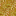
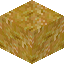
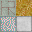
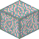
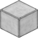
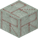

# bloxel
Isometric Voxel Generator.

Can be used to take an input texture such as this one:




And turn it into a 2.5D Bloxel with this command:

```sh
bloxel "examples/res/Grass.png"
```

Resulting in this image:



Note that the sides have been properly shaded.

## Installation

```sh
pip install git+https://github.com/Pebaz/bloxel.git
```

Or if done via Git:

```sh
git clone https://github.com/Pebaz/bloxel.git
pip install -r requirements.txt
```

## Usage

```sh
bloxel [ -o <out-path>] [ -a | ([ -nsew])] [ -b <blockname>] <all-sides>
bloxel [ -o <out-path>] [ -a | ([ -nsew])] -b <blockname> <up> <rest-sides>
bloxel [ -o <out-path>] [ -a | ([ -nsew])] -b <blockname> <up> <down> <rest-sides>
bloxel [ -o <out-path>] [ -a | ([ -nsew])] -b <blockname> <up> <down> <left> <right> <front> <back>
bloxel [ -o <out-path>] [ -a | ([ -nsew])] -t <tex> <num-wide> <num-long> [<block-file>]
bloxel -c <filename> <red> <green> <blue> [<alpha>] [--width=<width> --height=<height>]
bloxel -h | --help | -v | --version
```

Bloxel is also designed to be imported as a library when needed:

```python
from bloxel import iso

texture_size = 4
iso = bloxel.Iso(texture_size)
grass = iso.get_texture('examples/res/Grass.png')
direction = bloxel.Directions.NORTH
bloxel = iso.get_scalar_bloxel(direction, *([grass] * 6))
# Saves file as: './Bloxel-Grass-N.png'
iso.save(bloxel, direction, 'Grass', '.')
```


### Single Texture

```sh
bloxel -b MyBlock Grass.png
```

### Single Texture Multiple Directions

```sh
bloxel -b MyBlock -nw Grass.png
```

### Multiple Textures

```sh
bloxel -b MyBlock Grass.png Dirt.png
```

### Multiple Textures Multiple Directions

```sh
bloxel -b MyBlock -ne Grass.png Dirt.png
```

### All Directions (North, South, East, West)

```sh
bloxel -b MyBlock -a Grass.png Dirt.png
```

### Generate Solid Color Image (Useful for making primitive blocks)

```sh
bloxel -c "BlueBlock.png" 0 0 255 --width=16 --height=16
```

### Texture Map

```sh
bloxel -o "examples/TexMap" -n -t "examples/Sample.png" 2 2
```

Given this texture map:



Generate these four blocks and put them in `examples/TexMap/`









